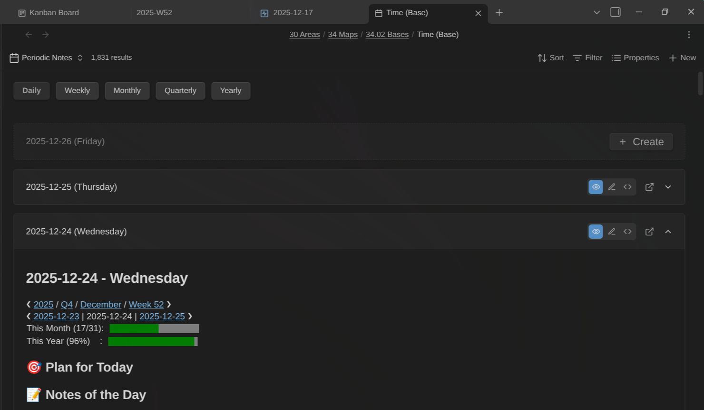
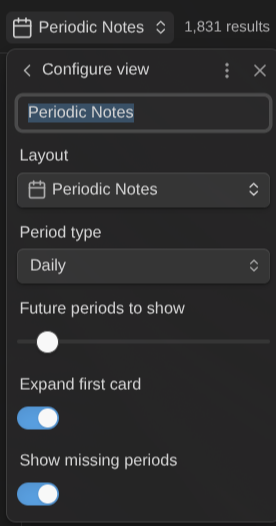
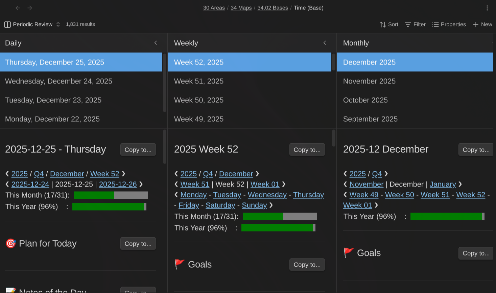
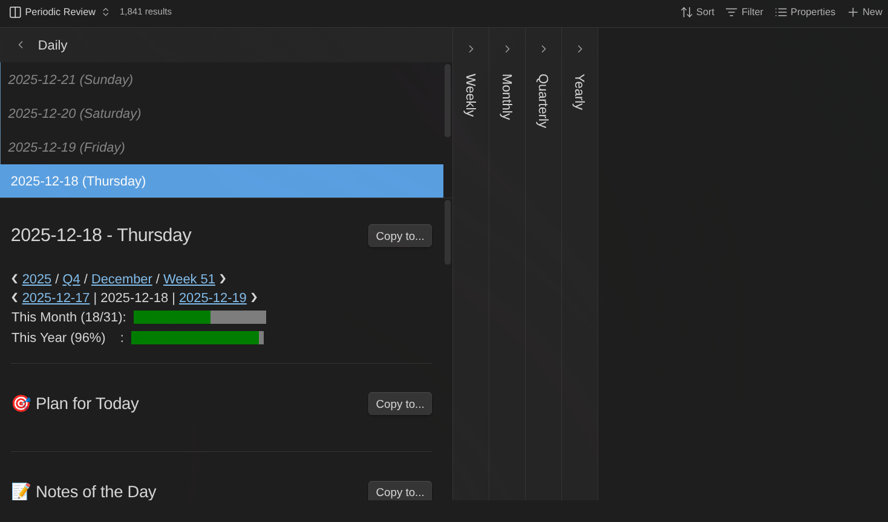
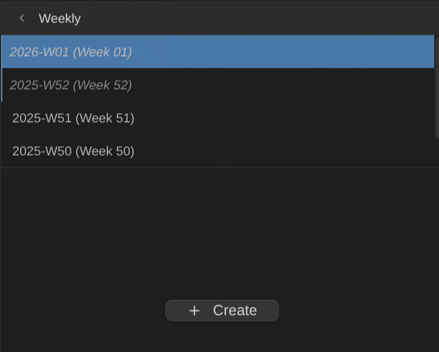

# Journal Bases Plugin for Obsidian

Navigate and manage your journal and periodic reviews with purpose-built Base views. This Obsidian plugin adds two custom view types for daily, weekly, monthly, quarterly, and yearly notes.

## Features

### Two Specialized Base Views

- **Periodic Notes View**: Card-based view for browsing notes of a single period type with inline editing
- **Periodic Review View**: Multi-column hierarchical view for reviewing notes across all period types simultaneously

### Note Cards

- **Expandable cards**: Click to expand/collapse note content
- **Three editing modes**: Reading view, Live Preview, and Source mode
- **Inline editing**: Edit notes directly within the view without opening a separate tab
- **Auto-save**: Changes saved automatically with 1-second debounce
- **Current period highlight**: Visual indicator for today's note

### Period Navigation

- **Hierarchical drilling**: In Periodic Review, click a year to see its quarters, a quarter to see its months, etc.
- **Period tabs**: Quick switching between period types in Periodic Notes view
- **Smart date handling**: ISO week numbering with proper year-boundary handling
- **Overlap display**: Weeks spanning month/year boundaries appear in both parent periods

### Note Creation

- **Missing note placeholders**: Create buttons for periods without notes
- **Template support**: Uses Templater for template-based note creation
- **Folder creation**: Automatically creates nested folder structures

### Integration

- **Periodic Notes plugin sync**: Automatically syncs settings when Periodic Notes plugin is enabled
- **Templater support**: Full integration for template-based note creation
- **Life Tracker integration**: Provides files for Life Tracker commands

## Screenshots

### Periodic Notes View

Browse your daily notes as expandable cards with inline editing. Toggle between Reading, Live Preview, and Source mode.

### Periodic Notes View Settings

Configure period type, future periods count, and display options per view.

### Periodic Review View

Review notes across multiple period types in a multi-column layout. Click a period to drill down into its children.

### Minimized Columns

Collapse columns to focus on specific period types. Click the fold button to expand/collapse.

### Create Missing Notes

Create buttons appear for periods without notes. Uses Templater templates when configured.

### Create Future Yearly Notes

Create next year's note directly from the yearly column header.

## Getting Started

### Prerequisites

- Obsidian v1.9.0 or later (requires Bases feature)
- (Optional) [Periodic Notes](https://github.com/liamcain/obsidian-periodic-notes) plugin for settings sync
- (Optional) [Templater](https://github.com/SilentVoid13/Templater) plugin for template support

### Installation

1. Open **Settings → Community plugins**
2. Click **Browse** and search for "Journal Bases"
3. Click **Install**, then **Enable**

### Configuration

1. Go to **Settings → Journal Bases**
2. Configure each period type:
    - **Folder**: Where notes are stored (e.g., `Journal/Daily`)
    - **Format**: Filename format using Moment.js tokens (e.g., `YYYY-MM-DD`)
    - **Template**: Path to Templater template file (optional)

If you have the Periodic Notes plugin enabled, settings will sync automatically.

### Using the Views

1. Create a new Base (or open an existing one)
2. Configure the Base query to include your periodic notes folder
3. Click the view type dropdown and select **Periodic Notes** or **Periodic Review**
4. Configure view-specific options via the settings menu

## View Options

### Periodic Notes View

| Option               | Description                             |
| -------------------- | --------------------------------------- |
| Period type          | Which period type to display            |
| Future periods       | Number of future periods to show (0-12) |
| Expand first card    | Auto-expand the most recent note        |
| Show missing periods | Show create buttons for missing notes   |

### Periodic Review View

| Option       | Description                              |
| ------------ | ---------------------------------------- |
| Show columns | Toggle visibility for each period type   |
| Column width | Width of each column in pixels (300-600) |

## Date Format Reference

Uses Moment.js format tokens:

| Token    | Output        | Example |
| -------- | ------------- | ------- |
| `YYYY`   | 4-digit year  | 2025    |
| `MM`     | 2-digit month | 01-12   |
| `DD`     | 2-digit day   | 01-31   |
| `gggg`   | ISO week year | 2025    |
| `ww`     | ISO week      | 01-53   |
| `[Q]`    | Literal "Q"   | Q       |
| `Q`      | Quarter       | 1-4     |
| `[text]` | Literal text  | text    |

**Default formats**:

- Daily: `YYYY-MM-DD`
- Weekly: `gggg-[W]ww`
- Monthly: `YYYY-MM`
- Quarterly: `YYYY-[Q]Q`
- Yearly: `YYYY`

Formats can include path separators: `YYYY/MM/YYYY-MM-DD` creates `2025/12/2025-12-18.md`

## Roadmap

See the [issues](https://github.com/dsebastien/obsidian-journal-base/issues) and [discussions](https://github.com/dsebastien/obsidian-journal-base/discussions) in this repository.

## News & Support

To stay up to date about this plugin, Obsidian in general, Personal Knowledge Management and note-taking, subscribe to [my newsletter](https://dsebastien.net). The best way to support my work is to become a paid subscriber ❤️.
