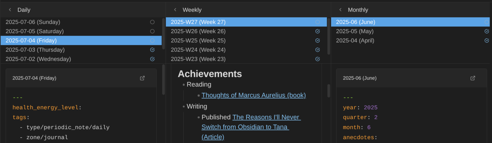

# Journal Bases Plugin for Obsidian

Navigate and manage your journal and periodic reviews with purpose-built Base views. This Obsidian plugin adds two custom view types for daily, weekly, monthly, quarterly, and yearly notes.

## Why This Plugin?

Journaling and periodic reviews are powerful practices for personal growth, but they can be labor-intensive. The core process is simple but requires discipline:

1. **Review daily notes once a week** to extract key learnings, discoveries, challenges faced, achievements, things you're grateful for, etc., and create a weekly note as a result
2. **Review weekly notes once a month** to extract key learnings, discoveries, and create a monthly note
3. **Review monthly notes once a quarter** to create a quarterly note
4. **Review quarterly notes once a year** to create a yearly note

Thanks to this process, at the end of a full year, you get a single yearly note that is a valuable summary of that year, giving you clarity about what you achieved, mistakes you've made, and things you've learned.

In addition to capturing information about the past, periodic notes also enable **looking forward and planning ahead**.

This plugin aims to codify and ease this process by providing dedicated views that make journaling and periodic reviews a breeze.

## The Two Views

This plugin provides two specialized Base view types, each designed for a specific workflow:

| View                | Purpose          | Workflow                                                                |
| ------------------- | ---------------- | ----------------------------------------------------------------------- |
| **Periodic Notes**  | Daily journaling | Navigate, view, edit, and create notes of a single period type          |
| **Periodic Review** | Periodic reviews | Side-by-side comparison across all period types for extracting insights |

---

## Periodic Notes Base

The **Periodic Notes** view is designed to support **daily journaling** with easier navigation between notes of a specific category (daily, weekly, monthly, quarterly, or yearly).

### What It Does

- Lists all notes for the selected period type in **descending order** (newest first)
- Enables **folding/expanding** individual notes to focus on what matters
- Provides **inline editing** so you can write without leaving the view
- Allows **creating new notes** for future periods
- Shows **placeholders for missing notes** in the sequence with one-click creation
- **Highlights the current period** so you always know where "today" is

### Use Cases

- Morning journaling routine
- Quick review of recent daily entries
- Batch-creating notes for upcoming days/weeks
- Filling in gaps when you missed a day

### Screenshot

_Browse your daily notes as expandable cards with inline editing. Toggle between Reading, Live Preview, and Source mode._

### View Options

| Option               | Description                                                              |
| -------------------- | ------------------------------------------------------------------------ |
| Period type          | Which period type to display (daily, weekly, monthly, quarterly, yearly) |
| Future periods       | Number of future periods to show (0-12)                                  |
| Expand first card    | Auto-expand the most recent note on load                                 |
| Show missing periods | Show create buttons for missing notes in the sequence                    |

---

## Periodic Review Base

The **Periodic Review** view has a different goal: serve during **periodic reviews** (weekly, monthly, quarterly, and yearly reviews) and make it a breeze to integrate information from daily notes into weekly notes, weekly into monthly, monthly into quarterly, and quarterly into yearly.

### What It Does

This view provides a **multi-column layout** (inspired by Andy Matuschak's sliding panes) where you can:

1. **Select or create a yearly note**, then
2. **Select or create a quarterly note**, then
3. **Select or create a monthly note**, then
4. **Select or create a weekly note**, then
5. **See all daily notes** for that week

The magic is in the **hierarchical drilling**:

- Select a certain **week** → see all daily notes from that week in the column to the left
- Select a certain **month** → see all weeks in that month
- Select a certain **quarter** → see all months in that quarter
- Select a certain **year** → see all quarters in that year

This makes it effortless to review your daily notes, extract the key insights, and write them into your weekly summary. Then review your weekly summaries and extract insights into your monthly note. And so on up the hierarchy.

### The Periodic Review Workflow

1. **Open the Periodic Review view** at the start of your weekly/monthly/quarterly/yearly review
2. **Navigate to the period** you want to review (e.g., select last week)
3. **Read through the child notes** in the left column (e.g., daily notes for that week)
4. **Extract key learnings** into the parent note (e.g., your weekly summary)
5. **Mark the review as done for that period** (optional)
6. **Repeat** at each level of the hierarchy

### Use Cases

- Weekly reviews: synthesizing daily notes into a weekly summary
- Monthly reviews: extracting themes from weekly notes
- Quarterly reviews: identifying patterns across months
- Yearly reviews: creating your annual summary

### Screenshot

_Review and edit notes across multiple period types in a multi-column layout. Each column shows a note card with full inline editing support. Click a period to drill down into its children._

### Additional Screenshots

**Mark Reviews as DONE**

_Mark reviews as done to know where you left things off_

**Minimize Columns**

_Collapse columns to focus on specific period types. Click the fold button to expand/collapse._

**Create Missing Notes**

_Create buttons appear for periods without notes. Uses Templater templates when configured._

**Create Future Yearly Notes**

_Create next year's note directly from the yearly column header._

### View Options

| Option       | Description                              |
| ------------ | ---------------------------------------- |
| Show columns | Toggle visibility for each period type   |
| Column width | Width of each column in pixels (300-600) |

---

## Common Features

Both views share these capabilities:

### Note Cards

- **Inline editing**: Edit notes directly within the view without opening a separate tab
- **Auto-save**: Changes saved automatically with 1-second debounce
- **Current period highlight**: Visual indicator for today's/current period's note
- **Seamless updates**: Content updates smoothly without flickering when files change externally

### Note Creation

- **Missing note placeholders**: Create buttons for periods without notes
- **Template support**: Uses Templater for template-based note creation
- **Folder creation**: Automatically creates nested folder structures

### Integration

- **Periodic Notes plugin sync**: Automatically syncs settings when Periodic Notes plugin is enabled
- **Templater support**: Full integration for template-based note creation
- **Life Tracker integration**: Provides daily notes for Life Tracker commands (works in both views)

---

## Getting Started

### Prerequisites

- Obsidian v1.9.0 or later (requires Bases feature)
- (Optional) [Periodic Notes](https://github.com/liamcain/obsidian-periodic-notes) plugin for settings sync
- (Optional) [Templater](https://github.com/SilentVoid13/Templater) plugin for template support

### Installation

1. Open **Settings → Community plugins**
2. Click **Browse** and search for "Journal Bases"
3. Click **Install**, then **Enable**

### Configuration

1. Go to **Settings → Journal Bases**
2. Configure each period type:
    - **Folder**: Where notes are stored (e.g., `Journal/Daily`)
    - **Format**: Filename format using Moment.js tokens (e.g., `YYYY-MM-DD`)
    - **Template**: Path to Templater template file (optional)

If you have the Periodic Notes plugin enabled, settings will sync automatically.

### Using the Views

1. Create a new Base (or open an existing one)
2. Configure the Base query to include your periodic notes folder
3. Click the view type dropdown and select **Periodic Notes** or **Periodic Review**
4. Configure view-specific options via the settings menu

---

## Date Format Reference

Uses Moment.js format tokens:

| Token    | Output        | Example |
| -------- | ------------- | ------- |
| `YYYY`   | 4-digit year  | 2025    |
| `MM`     | 2-digit month | 01-12   |
| `DD`     | 2-digit day   | 01-31   |
| `gggg`   | ISO week year | 2025    |
| `ww`     | ISO week      | 01-53   |
| `[Q]`    | Literal "Q"   | Q       |
| `Q`      | Quarter       | 1-4     |
| `[text]` | Literal text  | text    |

**Default formats**:

- Daily: `YYYY-MM-DD`
- Weekly: `gggg-[W]ww`
- Monthly: `YYYY-MM`
- Quarterly: `YYYY-[Q]Q`
- Yearly: `YYYY`

Formats can include path separators: `YYYY/MM/YYYY-MM-DD` creates `2025/12/2025-12-18.md`

---

## Contributing

This is a **free and open source project**. All contributions are welcome:

- Code improvements and new features
- Ideas and feature requests
- Documentation improvements
- Bug reports

See the [issues](https://github.com/dsebastien/obsidian-journal-base/issues) and [discussions](https://github.com/dsebastien/obsidian-journal-base/discussions) in this repository.

## News & Support

To stay up to date about this plugin, Obsidian in general, Personal Knowledge Management and note-taking, subscribe to [my newsletter](https://dsebastien.net). The best way to support my work is to become a paid subscriber ❤️.

This plugin is included in the [Obsidian Starter Kit](https://obsidianstarterkit.com).
